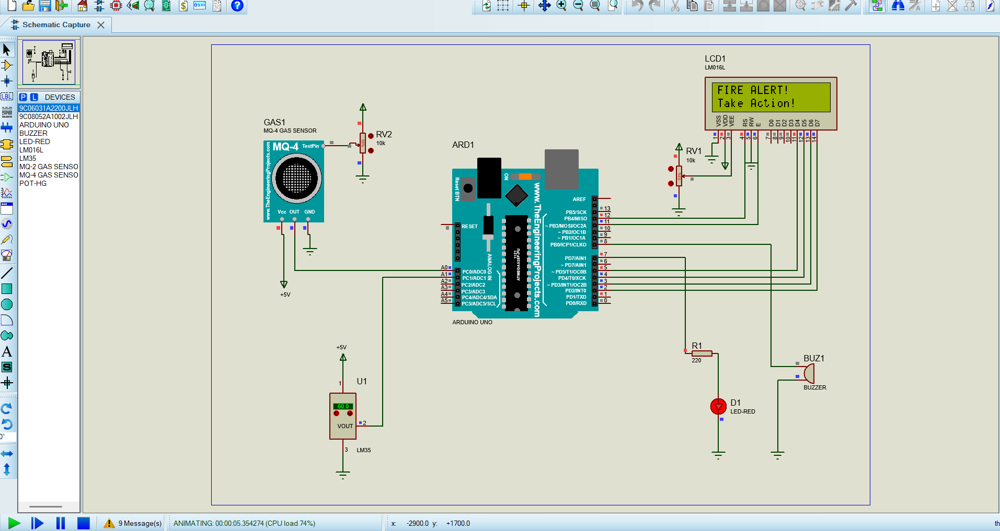

# .Smart-Fire-Detection-and-Safety-System
Smart Fire Detection and Safety System is an Arduino-based solution designed to detect fire hazards using flame and smoke sensors. The system continuously monitors the environment and activates alarms, buzzers, and safety alerts when fire or smoke is detected, helping to prevent accidents, improve safety, and reduce damage.
# 🔥 Smart Fire Detection and Safety System

## 📌 Project Description
The Smart Fire Detection and Safety System is an Arduino-based solution designed to detect fire hazards using flame and smoke sensors. The system continuously monitors the environment and activates alarms, buzzers, and safety alerts when fire or smoke is detected, helping to prevent accidents, improve safety, and reduce damage.

---

## 🎯 Objectives
- Detect fire and smoke automatically  
- Improve safety and emergency response  
- Reduce fire-related damage  
- Provide real-time alert system  

---

## ⚙️ Features
- Automatic fire detection  
- Smoke and flame sensor monitoring  
- Buzzer and alarm activation  
- Real-time safety alerts  
- Simple and cost-effective design  

---

## 🛠️ Technologies Used
- Arduino UNO  
- Flame Sensor  
- Smoke Sensor  
- Buzzer  
- LEDs  
- Embedded C  
- Proteus Simulation  

---

## 📂 Project Files
- `firedetectionsystem.ino` → Arduino code  
- `firedetection.pdsprj` → Proteus simulation  
- `simulation.png` → Circuit image  

---

## 📷 Project Output

---

## 🚀 Future Scope
- IoT-based fire monitoring system  
- SMS and mobile app alerts  
- Automatic water sprinkler integration  
- Smart building safety implementation  

---

## 👩‍💻 Author
Shreya Patil
